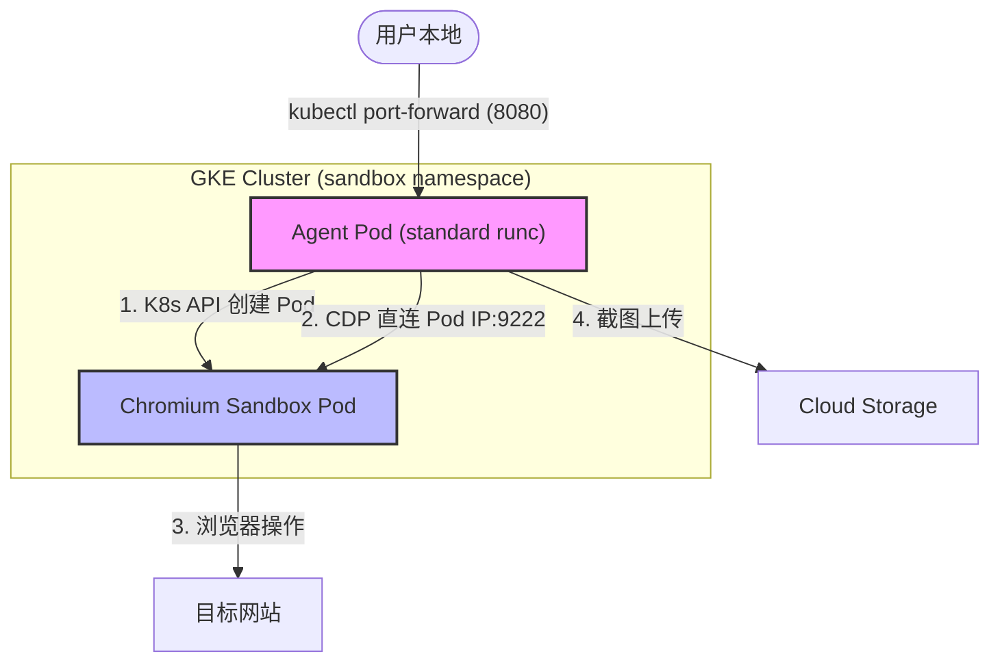
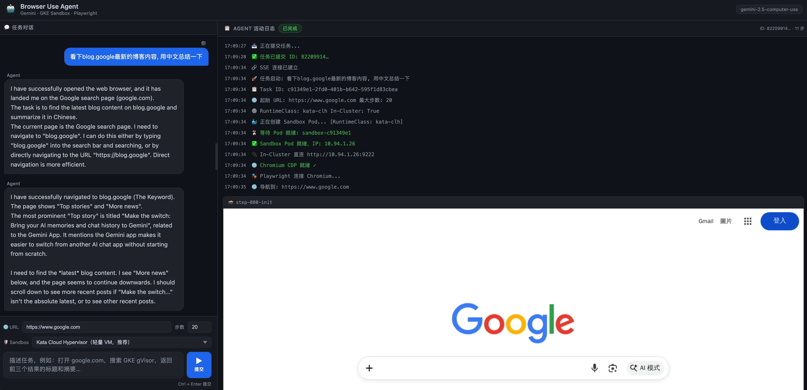
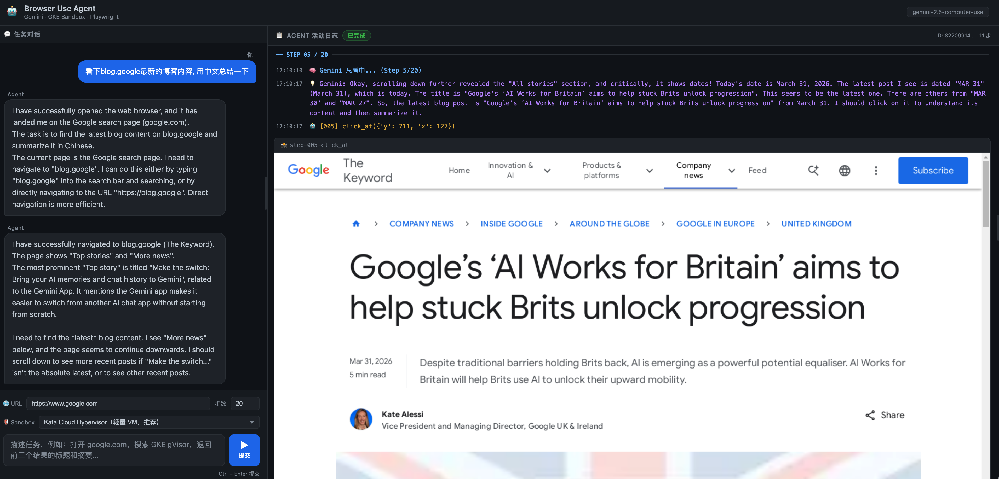
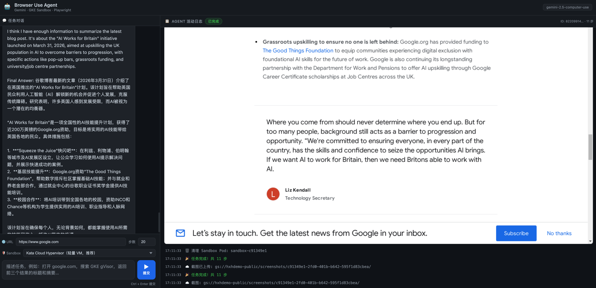

# Browser Use Sandbox on GKE

基于 **Gemini Browser Use API** 的浏览器自动化 Demo。Agent 运行在 GKE 中，每个任务动态创建隔离的 Chromium Sandbox Pod 执行操作，支持 gVisor / Kata Containers 等多种沙箱运行时。

## 架构



1. **用户本地** → 通过 `kubectl port-forward` 连接 Agent Pod，打开 Web Chat UI 或调用 API 提交任务。
2. **Agent Pod** → 调用 Kubernetes API 在 `sandbox` namespace 下动态创建 **Chromium Sandbox Pod**。
3. **隔离执行** → Agent 通过 Pod IP 直连 Sandbox Pod 的 CDP 端口，调用 Gemini Browser Use 模型 循环执行动作 + 截图。
4. **结果返回** → 截图实时上传 GCS，通过 SSE 流推送到前端展示；任务完成后自动销毁 Sandbox Pod。

---

## Demo 截图

| 任务启动 | 浏览器自动化 | 任务完成 |
|:---:|:---:|:---:|
|  |  |  |

---

## 前置条件

- GCP 项目已启用：GKE API、Vertex AI API、Cloud Storage API、Cloud Build API
- 本地已安装：`gcloud`、`kubectl`
- 已完成认证：

```bash
# ⚠️ 以下变量请替换为你自己的值
export PROJECT_ID="<YOUR_PROJECT_ID>"
export REGION="<YOUR_REGION>"               # 例如 asia-east1
export AR_REPO="<YOUR_ARTIFACT_REGISTRY>"   # 例如 my-repo
export CLUSTER_NAME="<YOUR_CLUSTER_NAME>"

gcloud auth application-default login
gcloud config set project $PROJECT_ID
```

---

## Step 1 — 获取 GKE 集群凭证

```bash
gcloud container clusters get-credentials $CLUSTER_NAME \
  --region $REGION \
  --project $PROJECT_ID

# 验证
kubectl get nodes
```

---

## Step 2 — 创建 Sandbox Namespace

```bash
kubectl apply -f sandbox/namespace.yaml
```

---

## Step 3 — 构建 Agent 镜像

```bash
gcloud builds submit \
  --tag ${REGION}-docker.pkg.dev/${PROJECT_ID}/${AR_REPO}/browser-use-agent:latest \
  --project $PROJECT_ID \
  .
```

---

## Step 4 — 部署 Agent Pod

构建完成后，更新 `sandbox/agent-deployment.yaml` 中的镜像地址，然后部署：

```bash
# 更新镜像地址（或手动编辑 YAML）
sed -i.bak "s|<YOUR_REGION>|${REGION}|g; s|<YOUR_PROJECT_ID>|${PROJECT_ID}|g; s|<YOUR_REPO>|${AR_REPO}|g" \
  sandbox/agent-deployment.yaml

kubectl apply -f sandbox/agent-deployment.yaml

# 等待 Ready
kubectl rollout status deployment/browser-use-agent -n sandbox
```

---

## Step 5 — Port-Forward 连接 Agent

```bash
kubectl port-forward deployment/browser-use-agent 8080:8080 -n sandbox
```

另开终端验证：

```bash
curl http://localhost:8080/health
```

---

## Step 6 — 使用 Web Chat UI

port-forward 建立后，直接浏览器访问：

```
http://localhost:8080/
```

- 💬 **左侧**：对话面板，输入任务描述（Ctrl+Enter 快速提交）
- 📋 **右侧**：实时 Agent 日志 + 截图（SSE 推送，无需刷新）
- 🖼️ 截图可点击放大查看

---

## Step 7 — 通过 API 提交任务（可选）

```bash
curl -X POST http://localhost:8080/task/sync \
  -H "Content-Type: application/json" \
  -d '{
    "task": "看下 ycombinator top 10 新闻, 用中文总结",
    "starting_url": "about:blank",
    "max_steps": 15
  }'
```

---

## Sandbox 镜像选型

通过环境变量 `SANDBOX_IMAGE` 或 `agent-deployment.yaml` 中的 env 配置：

| 镜像 | 镜像大小 | `--headless=new` | 说明 |
|---|---|---|---|
| `zenika/alpine-chrome:latest` | ~200MB | ❌ | 默认，轻量 |
| `chromedp/headless-shell:latest` | ~300MB | ✅ | 推荐，专为 CDP 设计 |
| `browserless/chromium:latest` | ~400MB | ✅ | browserless 生态 |

> 💡 `chromedp/headless-shell` 镜像本身即为 headless shell，启动参数无需 `--headless`，且更难被网站检测为 bot。

---

## 配置 Sandbox RuntimeClass

Sandbox Pod 的隔离运行时可在 Web Chat UI 的 **🛡️ Sandbox** 下拉中按任务选择，无需修改部署配置：

| RuntimeClass | 隔离方式 | 前置要求 |
|---|---|---|
| `standard runc` | 无额外隔离 | 无 |
| `gvisor` | 用户态内核（syscall 拦截） | GKE gVisor node-pool（COS 镜像） |
| `kata-qemu` | 轻量级 VM（QEMU） | Kata Deploy（Ubuntu 镜像） |
| `kata-clh` | 轻量级 VM（Cloud Hypervisor） | Kata Deploy（Ubuntu 镜像） |
| `kata-fc` | microVM（Firecracker） | Kata Deploy + devmapper snapshotter |

> Agent Pod 部署在 GKE 集群内，通过 in-cluster 直连 Pod IP，所有 RuntimeClass 均可用。

---

### 使用 gVisor 的前置要求

gVisor 必须在创建 node-pool 时开启，且只支持 **COS** 镜像：

```bash
gcloud container node-pools create gvisor-pool \
  --cluster $CLUSTER_NAME \
  --region $REGION \
  --machine-type n2-standard-2 \
  --image-type COS_CONTAINERD \
  --sandbox type=gvisor \
  --num-nodes 1
```

> ⚠️ GKE 系统组件无法调度到 gVisor 节点，集群中必须已有至少一个 standard 节点。

---

### 使用 Kata Containers 的前置要求

Kata 依赖 KVM 虚拟化，GKE 节点必须满足：
- **启用嵌套虚拟化**（`--enable-nested-virtualization`）
- **Ubuntu 镜像**（COS 不支持）
- **支持嵌套虚拟化的机型**：N1、N2、N2D、N4、C3、C4 等（[完整列表](https://cloud.google.com/compute/docs/instances/nested-virtualization/overview#restrictions)）

```bash
gcloud container node-pools create kata-pool \
  --cluster $CLUSTER_NAME \
  --region $REGION \
  --machine-type n2-standard-4 \
  --image-type UBUNTU_CONTAINERD \
  --enable-nested-virtualization \
  --num-nodes 1
```

> 📖 参考：[GKE 嵌套虚拟化](https://cloud.google.com/kubernetes-engine/docs/how-to/nested-virtualization) · [Compute Engine 嵌套虚拟化](https://cloud.google.com/compute/docs/instances/nested-virtualization/enabling)

通过 Helm 安装 kata-deploy：

```bash
export VERSION=$(curl -sSL https://api.github.com/repos/kata-containers/kata-containers/releases/latest \
  | jq .tag_name | tr -d '"')

helm install kata-deploy -n kube-system \
  "oci://ghcr.io/kata-containers/kata-deploy-charts/kata-deploy" \
  --version "${VERSION}"

# 等待就绪
kubectl rollout status daemonset/kata-deploy -n kube-system

# 验证
kubectl get runtimeclass | grep kata
```

> ⚠️ `kata-fc`（Firecracker）额外要求 containerd 配置 **devmapper snapshotter**（GKE 默认 overlayfs 不兼容）。如无特殊需求，建议使用 `kata-qemu` 或 `kata-clh`。

> 💡 `kata-clh`（Cloud Hypervisor）是 Kata Containers 推荐的轻量 VMM，相比 QEMU 启动更快、内存开销更低，适合对启动速度敏感的场景。kata-deploy 安装后会自动注册 `kata-clh` RuntimeClass。

---

## 环境变量

通过 `agent-deployment.yaml` 的 `env` 字段或容器运行时传入：

| 变量 | 说明 | 默认值 |
|------|------|--------|
| `GCP_PROJECT_ID` | GCP 项目 ID | — |
| `VERTEX_LOCATION` | Vertex AI 地区 | `global` |
| `GCS_RESULTS_BUCKET` | 截图存储 GCS Bucket | — |
| `BROWSER_USE_MODEL` | Browser Use 模型 | `gemini-2.5-computer-use-preview-10-2025` |
| `MAIN_AGENT_MODEL` | 主 Agent 模型 | `gemini-3-flash-preview` |
| `SUBAGENT_MODEL` | Sub-Agent 编排模型 | `gemini-3-flash-preview` |
| `SANDBOX_IMAGE` | Chromium Sandbox 镜像 | `zenika/alpine-chrome:latest` |
| `SANDBOX_NAMESPACE` | K8s 命名空间 | 自动检测（Downward API） |
| `SANDBOX_PORT` | CDP 端口 | `9222` |
| `POD_READY_TIMEOUT` | Pod 就绪超时（秒） | `60` |
| `SERVER_MODE` | 启用 HTTP 服务器 | `true`（Dockerfile 默认） |
| `SERVER_PORT` | HTTP 服务器端口 | `8080` |

---

## 文件结构

```
browser_use_demo/
├── agent-run-jobs.py           # Multi-Agent 主程序（HTTP 服务器 + CLI）
├── agent-local.py              # 本地 Chrome CDP 版（独立工具，无需 K8s）
├── Dockerfile                  # Agent 镜像
├── requirements.txt            # Python 依赖
├── README.md
├── .gitignore
├── static/
│   └── index.html              # Web Chat UI（暗色主题，SSE 实时日志 + 截图）
├── images/                     # Demo 截图
└── sandbox/
    ├── namespace.yaml          # sandbox namespace
    └── agent-deployment.yaml   # Agent Deployment + RBAC
```
